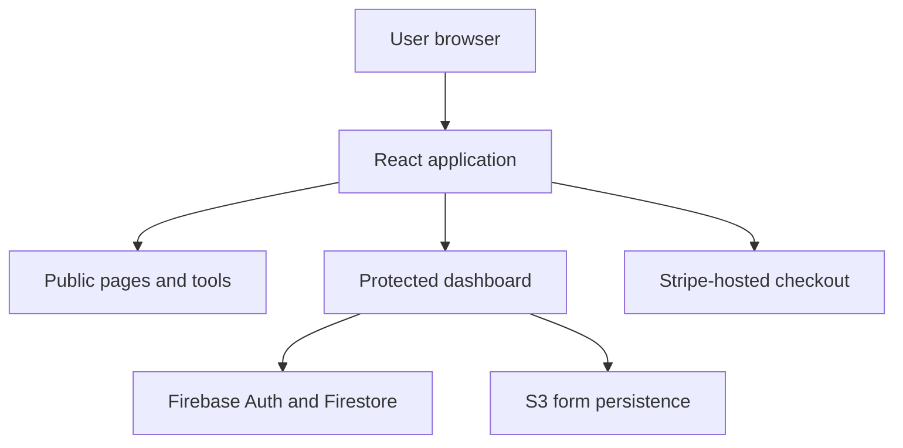

# Architecture overview

SyncYourCloud is a React 18 single-page application with public pages, protected dashboard routes and standalone guide pages.

## Logical architecture

This diagram shows logical responsibilities. It does not imply that every tool calls every service.

## Presentation layer

The React application uses two principal layout modes:

- **Public layout:** shared header and footer, with no authentication requirement.
- **Dashboard layout:** protected routes inside a dashboard shell. An unauthenticated visitor is redirected to the authentication page.

Standalone guide routes are public but intentionally omit the main header, footer and dashboard shell.

## Identity and membership

Firebase Authentication manages sign-in state. The application supports email and password flows and Google sign-in. A React user context listens for authentication changes and exposes the current user to the component tree.

Firestore stores the user record and membership state. A real-time listener updates the interface when membership data changes.

See [Authentication and access](authentication-and-access.md).

## Assessment and tool execution

The documented payment tools run their calculations in the browser. They generate reports, policy examples and infrastructure-as-code examples, but they do not deploy the output.

The cloud assessment service can attempt a configured remote request. The documented application includes a five-second timeout and a local assessment-definition fallback. The fallback behaviour must remain visible in technical documentation because it changes how a result was produced.

## Data persistence

The documented `prescreenS3Service` saves and retrieves pre-screen form data through AWS Amplify Storage. Automatic saving is debounced by two seconds to reduce unnecessary S3 operations.

Assessment answers and result state can also move between React routes in client-side navigation state. The supplied documentation does not establish that every assessment result is stored in S3.

Firestore stores user and membership information. It also supports enquiry and quota-related records in the documented implementation.

## Payments

Self-service membership actions open hosted Stripe Payment Links. SyncYourCloud does not collect card details inside the React application in this flow. Higher-touch tiers use an enquiry journey rather than direct self-service checkout.

## External service boundaries

| Service | Documented responsibility | Not implied |
| --- | --- | --- |
| Firebase Authentication | User sign-in and session state | Payment processing |
| Firestore | User, membership and selected usage records | Storage for every generated report |
| AWS Amplify Storage/S3 | Pre-screen form persistence | A public assessment API |
| Stripe Payment Links | Hosted subscription checkout | Custom card-processing code in SyncYourCloud |
| EmailJS | Enquiry and notification workflows | Durable operational event processing |

## Current limitations

See [Known limitations](../reference/known-limitations.md) before describing the system in a portfolio, CV or application.

